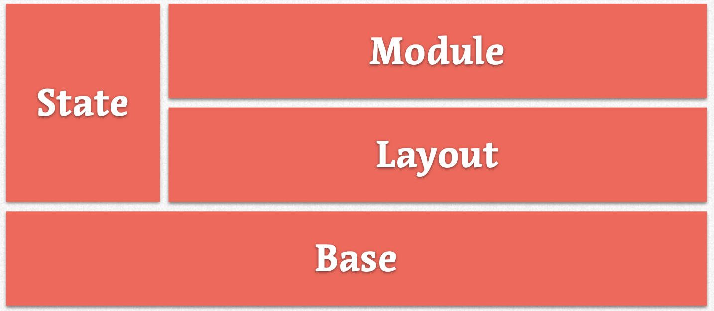

# Guide for CSS Styling

Inorder to better manage css with minimal damage control we used following principles and technologies

1. SMACSS (principles on managing css, access website [here](https://smacss.com/))
2. SASS (preprocessor for css with rich features)
3. BEM methodology for naming

BEM and SASS go hand-in-hand, [read this](https://andrew-barnes.medium.com/bem-and-sass-a-perfect-match-5e48d9bc3894) for more informations

## SMACSS (Scalable and Modular Architecture for CSS)

SMACSS has principles/rules for categories of ui components

### SMACSS categories



- Base rules are the defaults. (like global.css or css resets or normalize.css)
- Layout rules divide the page into sections. Layouts hold one or more modules together.
- Modules are the reusable, modular parts of our design.
- State rules are ways to describe how our modules or layouts will look when in a particular state.
- Finally, Theme rules are similar to state rules in that they describe how modules or layouts might look.

## Selector Performance Considerations

### How CSS gets evaluated

browsers are designed to handle documents like a stream. They begin to receive the document from the server and can render the document before it has completely downloaded. Each node is evaluated and rendered to the viewport as it is received.

```html
An example HTML document
<body>
  <div id="content">
    <div class="module intro">
      <p>Lorem Ipsum</p>
    </div>
    <div class="module">
      <p>Lorem Ipsum</p>
      <p>Lorem Ipsum</p>
      <p>Lorem Ipsum <span>Test</span></p>
    </div>
  </div>
</body>
```

The browser starts at the top and sees a body element. At this point, it thinks it is empty. It hasn’t evaluated anything else. The browser will determine what the computed styles are and apply them to the element. What is the font, the color, the line height? After it figures this out, it paints it to the screen.

Next, it sees a div element with an ID of content. Again, at this point, it thinks it is empty. It hasn’t evaluated anything else. The browser figures out the styles and then the div gets painted. The browser will determine if it needs to repaint the body—did the element get wider or taller? (I suspect there are other considerations but width and height changes are the most common effects child elements have on their parents.)

For a visualization of the reflow/repaint process in Firefox, visit [here](http://youtu.be/ZTnIxIA5KGw).

### CSS gets evaluated from right to left

To determine whether a CSS rule applies to a particular element, it starts from the right of the rule and works its way left.

If you have a rule like body `div#content p { color: #003366; }` then for every element—as it gets rendered to the page—it will first ask if it is a paragraph element. If it is then it will work its way up the DOM and ask if it is a divwith an ID of content. If it finds what it is looking for, it will continue its way up the DOM until it reaches the body.

By working right to left, the browser can determine whether a rule applies to this particular element that it is trying to paint to the viewport much faster. To determine which rule is more or less performant, you need to figure out how many nodes need to be evaluated to determine whether a style can be applied to an element.

- As a rule try to use direct descendant (>) selctor like `parent > child`
